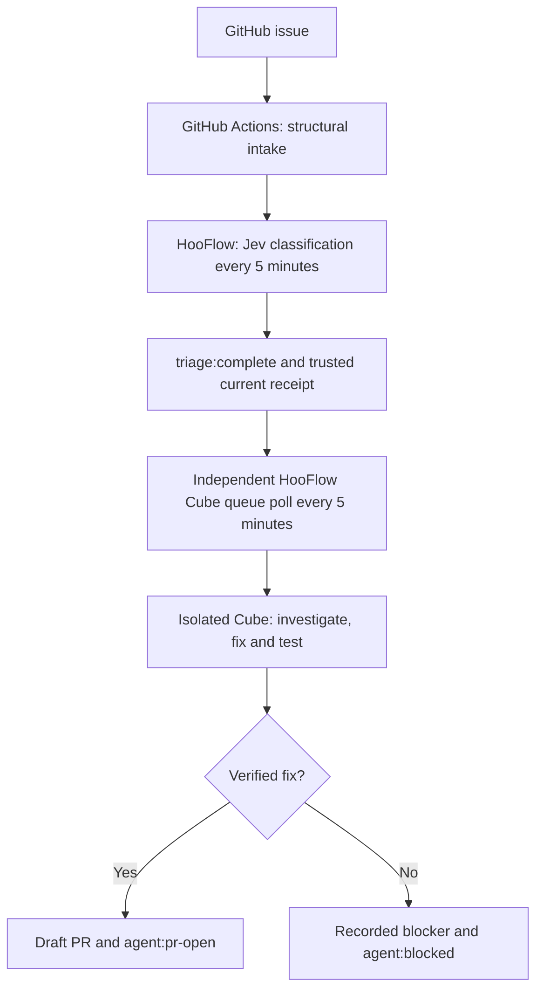

# Automatic triage and Cube fixes

Two independent [HooFlow](https://hooapps-01.char-lenok.ts.net:8443) workflows
coordinate the automation. The editor is reachable only through Tailscale.
GitHub is queried outbound; there is no public webhook or GitHub-to-tailnet
identity.



Jev classifies issues. It does not ask the reporter questions, create a Cube,
assign a fix, verify implementation evidence, or grant `ready-for-agent`.
The separately enabled Cube workflow picks eligible issues from the queue and
performs the investigation and fix. It publishes draft PRs, never merges or
closes issues automatically.

Production code and deployment are versioned in the HooApps runbooks:
[Jev classification](https://github.com/openhoo/hooapps-gitops/blob/main/services/hooflow-triage/README.md)
and [Cube queue and fixes](https://github.com/openhoo/hooapps-gitops/blob/main/services/hooflow-cube-fix/README.md).
These sources, rather than the historical semantic scripts in this repository,
define the current runtime and operational limits.

## Stage 1: classify without questions

[HoonarqubeJevTriage](https://hooapps-01.char-lenok.ts.net:8443/workflow/HoonarqubeJevTriage)
runs every five minutes; `Jetzt prüfen` starts the same bounded pass manually.
The existing GitHub Actions Issue intake checks the seven canonical form
fields and the reporter's category. Structural notices about malformed forms
remain separate from semantic classification.

For a structurally valid open issue, Jev reads the full body and discussion,
excluding trusted automation receipts. It uses HooLLM `typesafe/jev-1.13` at
`https://ai.openhoo.ai/v1/decisions` with fixed Choice fields. It cannot execute
commands or author free text. Each answer must match the expected schema,
known Jev 1.13 model identity and complete probability distribution. Both the
confidence and selected probability must be at least 0.95. Less certain
answers remain unknown; confidence is not proof of factual correctness.

The bounded writer, `openhoo-hooflow[bot]`, maintains supported language, area
and priority labels and one AI-disclosed classification note. It preserves
human labels and explicit human removals. It does not ask follow-up questions
or create a semantic `needs-info` transition. Structural intake retains its
separate `github-actions[bot]` identity and ownership rules.

An issue enters the automatic queue only when all of these hold:

- the issue is open, the canonical form is valid, and the category is singular;
- the confident classification agrees with the form's classification;
- security routing confidently says ordinary issue;
- expected/actual behavior and acceptance criteria are present;
- there is no protected or conflicting state, manual `needs-info`, or other
  maintainer decision that excludes automatic work; and
- the final classification receipt has been applied and read back successfully.

Unknown language, area or priority leaves that label unset and does not by
itself prevent queue eligibility. Missing reproduction, provenance or other
technical context is for the Cube to investigate within the stated behavior
and acceptance; the classifier does not manufacture that evidence. A security
case or uncertain security routing is withheld for private/manual handling.
A security-rule analyzer report is not itself a vulnerability in Hoonarqube.

## Queue contract

`triage:complete` is a supplemental signal that semantic classification
finished and this input may be investigated by the explicitly enabled Cube
worker. It is **not** a canonical state, evidence certification, or a synonym
for `ready-for-agent`. An eligible issue can therefore retain `needs-triage`
while its Cube establishes the evidence needed for a safe fix.

The label alone grants no work. The picker requires the completed v2 receipt
from the real `openhoo-hooflow[bot]` identity: `applied: true`,
`queueEligible: true`, validated decisions, and a repository/issue-bound
fingerprint matching the current issue body and discussion. Forged markers,
old v1 notes, incomplete writes and stale receipts are not queue authority.
A new edit or discussion invalidates the old input until classification is
refreshed. Maintainer exclusions are checked again at pickup.

The four canonical states remain `needs-triage`, `needs-info`,
`ready-for-agent` and `wontfix`. These additional labels describe execution,
not semantic readiness or resolution:

| Supplemental label | Meaning |
| --- | --- |
| `triage:complete` | Completed semantic classification; a current trusted receipt is required for pickup. |
| `agent:working` | A Cube run owns the issue and is investigating or implementing it. |
| `agent:pr-open` | A draft PR is available for review; the issue is not merged or resolved. |
| `agent:blocked` | The run stopped with a concrete recorded blocker, not a question to the reporter. |

## Stage 2: independent Cube pickup

[HoonarqubeCubeFix](https://hooapps-01.char-lenok.ts.net:8443/workflow/HoonarqubeCubeFix)
("Hoonarqube — Cube-Fixes aus der Queue") runs every five minutes and also has
a manual trigger. It polls the host broker's `/tick` endpoint independently
of the Jev workflow. There is no dispatch instruction in a Jev response and
no direct call from semantic triage to the Cube broker.

The broker rereads eligible issues, validates their receipts and excludes
existing linked/open PRs, stale inputs and conflicting ownership. Its
persistent ledger prevents duplicate pickup across polling passes and
restarts. At most one Cube job runs at a time. It preserves
`triage:complete` and records the execution status separately.

The worker pins the issue, discussion and source base, then runs the
repository's investigation, narrow fix and focused verification workflow in
an isolated Cube. It must establish missing technical context itself from
source, tests and bounded reproductions. It cannot infer new requirements or
invent acceptance criteria. If evidence, authority, dependencies or meaningful
verification remain unavailable, it records a blocked run without asking the
reporter questions or presenting the attempt as a fix.

A successful worker publishes a draft PR at the tested head with the
repository template and actual verification evidence. It uses related-issue
references rather than automatic closing keywords. The issue stays open.
A person reviews the draft and controls any later merge or closure; neither
Jev nor the Cube schedule bypasses CI, repository protections or reviews.
Public reports of suspected vulnerabilities stay out of this path.

## Operation and failure handling

Publish or unpublish each HooFlow workflow separately to enable or stop its
schedule. Stopping triage does not dispatch or cancel a Cube job; stopping the
picker does not stop classification. Inspect and reconcile an existing run
through the Cube runbook before changing ownership or retrying blocked work.
Do not remove an execution label to evade the persisted ledger.

Classification retains bounded polling, unchanged-input deduplication,
provider timeouts, schema validation and retry backoff. The dispatcher is on
loopback within the private HooFlow pod. Credentials stay in the configured
secret stores and do not enter issue text, workflow output or agent prompts.
Jev uses the dedicated HooFlow key and configured request/budget limits.
The Cube broker uses its separately scoped runtime access; the triage writer
does not gain source or pull-request write permission to dispatch work.

Before writes, the classifier rereads issue content, labels and timeline;
unexpected changes stop that attempt. It saves ownership intent before
mutations and reads back labels and the completed note afterward. GitHub
comment and label writes are not atomic, so an incomplete receipt cannot
start a Cube. A failed model request, malformed response, or private/uncertain
security routing does not create a queue receipt for that input.

The GitHub Actions workflow in this repository is structural-only. Its old
semantic Jev steps, comment trigger and manual Jev dispatch have been removed;
setting `HOONARQUBE_JEV_TRIAGE_ENABLED` cannot activate a second semantic
writer. `.github/scripts/issue-jev-triage*` and `jev-triage-policy.cjs` are
historical v1 regression references, not the deployed classifier. Do not
restore their question-asking behavior as an operating path.

## Validation

Run the structural intake and historical policy regressions with:

```sh
node --test .github/scripts/issue-intake.test.cjs .github/scripts/issue-jev-triage.test.cjs
```

The historical v1 tests intentionally describe the retired policy and are not
proof of the current no-question behavior. The HooApps runbooks own current
classification, receipt, polling, ownership, broker and Cube tests. Validate
both an actual eligible pickup and duplicate/stale/forged-receipt refusals;
read back the draft PR or blocked result before claiming the automation works.
A successful classification or green workflow run alone is not evidence of a
working fix.

Typed decisions follow the [TypeSafe Choice API](https://docs.typesafe.ai/primitives/choice).
The public HooLLM alias remains fixed; the validated reply may use OpenRouter's
`typesafe/jev-1.13` (including dated revisions), OpenCode's `jev-1.13-free`, or
TypeSafe's `jev-1.13` / `jev-1.13.0` for that route.
